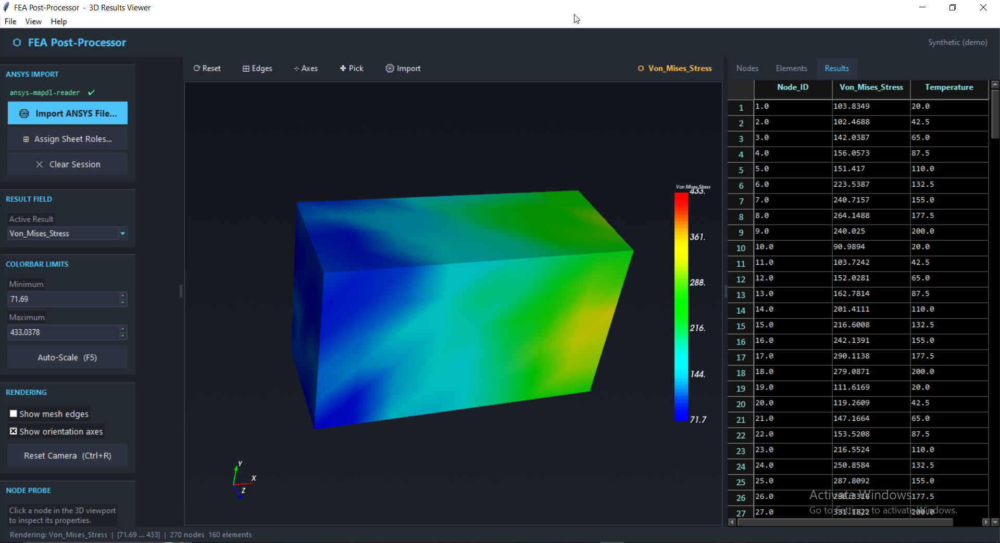

# FEA Post-Processor — 3D Results Viewer

A professional, high-performance desktop application for visualising Finite
Element Analysis results. Built with Python, it combines a Tkinter UI shell
with a hardware-accelerated VTK/PyVista 3D graphics pipeline.

---

## Architecture Overview

```
┌─────────────────────────────────────────────────────────────────────┐
│                        FEAPostProcessor                             │
│  (tk.Tk root — orchestrates all subsystems)                         │
│                                                                     │
│  ┌──────────────┐  ┌────────────────────────┐  ┌───────────────┐   │
│  │  Left Panel  │  │    Centre Viewport     │  │  Right Panel  │   │
│  │  (Sidebar)   │  │  vtkTkRenderWindow     │  │  Data Grid    │   │
│  │              │  │  + PyVista Renderer    │  │  (tksheet)    │   │
│  │ • Result     │  │                        │  │               │   │
│  │   selector   │  │  UnstructuredGrid      │  │ • Nodes tab   │   │
│  │ • Colorbar   │  │  (Hex8 elements)       │  │ • Elements    │   │
│  │   min/max    │  │  Gouraud shading       │  │ • Results     │   │
│  │ • Probe box  │  │  Jet LUT colorbar      │  │               │   │
│  │ • Mesh stats │  │  Axes widget           │  │               │   │
│  └──────────────┘  └────────────────────────┘  └───────────────┘   │
│                                                                     │
│  Data Layer (pandas DataFrames)                                     │
│  ┌────────────┐  ┌──────────────┐  ┌──────────────────────────┐    │
│  │  nodes_df  │  │ elements_df  │  │       results_df         │    │
│  │ Node_ID    │  │ Element_ID   │  │ Node_ID                  │    │
│  │ X, Y, Z   │  │ N1 … N8     │  │ Von_Mises_Stress         │    │
│  └────────────┘  └──────────────┘  │ Temperature              │    │
│                                    └──────────────────────────┘    │
│  NumPy Pipeline → pv.UnstructuredGrid (VTK backend)                │
└─────────────────────────────────────────────────────────────────────┘
```

---

## Installation

### Requirements

| Package    | Version  | Purpose                          |
|------------|----------|----------------------------------|
| Python     | ≥ 3.10   | Language runtime                 |
| pyvista    | ≥ 0.43   | High-level VTK mesh API          |
| vtk        | ≥ 9.2    | OpenGL render pipeline           |
| tksheet    | ≥ 7.0    | Spreadsheet-style data grid      |
| pandas     | ≥ 2.0    | Tabular data model               |
| numpy      | ≥ 1.24   | Contiguous array pipeline        |

### One-line install

```bash
pip install pyvista vtk tksheet pandas numpy
```

### Run

```bash
python fea_postprocessor.py
# or
python launch.py        # guided launcher with dependency check
```

---

## Module Map

```
fea_postprocessor.py
│
├── generate_synthetic_fea_data(nx, ny, nz)
│     Builds a structured nx×ny×nz hexahedral mesh and returns
│     three DataFrames: nodes_df, elements_df, results_df.
│     Scalar fields are analytical (Von Mises peaks near corner,
│     Temperature is a linear + sinusoidal gradient).
│
├── build_vtk_unstructured_grid(nodes_df, elements_df, results_df)
│     Pure-NumPy pipeline that converts the DataFrames into a
│     pv.UnstructuredGrid with all result arrays attached as
│     point_data.  No Python-level VTK cell loop — uses
│     np.vectorize + hstack for O(n) flat array construction.
│
└── FEAPostProcessor(root)
      │
      ├── _configure_root()          ttk.Style theme (dark palette)
      ├── _build_menu()              File / View / Help menubar
      ├── _build_layout()
      │     ├── _build_left_panel()  Sidebar with scrollable content
      │     ├── _build_center_panel() Toolbar + VTK viewport frame
      │     └── _build_right_panel() Tab strip + data grid
      │
      ├── _init_vtk_renderer()
      │     Creates vtkTkRenderWindowInteractor, attaches a PyVista
      │     Renderer, sets TrackballCamera interactor style, and
      │     adds an OrientationMarkerWidget (axes).
      │
      ├── _render_mesh()
      │     Core render loop:
      │       1. Save camera state
      │       2. Remove old actors
      │       3. Activate scalar, validate clim
      │       4. Build vtkDataSetMapper + Jet LUT
      │       5. Add vtkActor (Gouraud shading)
      │       6. Add vtkScalarBarActor (colorbar)
      │       7. Restore camera → Render()
      │
      ├── _enable_picking()
      │     Registers a LeftButtonPressEvent observer using
      │     vtkPointPicker.  On click: picks nearest point,
      │     extracts node data from DataFrames, writes to the
      │     probe text box, renders a highlight sphere.
      │
      └── Callbacks
            _on_result_changed()     Combobox → re-render
            _on_colorbar_changed()   Spinbox  → validate → re-render
            _on_edges_toggled()      Checkbox → re-render
            _on_axes_toggled()       Checkbox → axes widget enable/disable
            _on_picking_toggled()    Checkbox → enable/disable picker
```

---

## Mouse Controls (3D Viewport)

| Gesture              | Action          |
|----------------------|-----------------|
| Left-button drag     | Rotate (tumble) |
| Right-button drag    | Zoom            |
| Middle-button drag   | Pan             |
| Scroll wheel         | Zoom in/out     |
| `r` key              | Reset camera    |

---

## Extending the Application

### Load a real Excel/CSV workbook

Replace the `generate_synthetic_fea_data()` call in `FEAPostProcessor.__init__`
with your own loader:

```python
import pandas as pd

nodes_df    = pd.read_excel('my_model.xlsx', sheet_name='Nodes')
elements_df = pd.read_excel('my_model.xlsx', sheet_name='Elements')
results_df  = pd.read_excel('my_model.xlsx', sheet_name='Results')

# Column requirements:
#   nodes_df    → [Node_ID, X, Y, Z]
#   elements_df → [Element_ID, N1, N2, N3, N4, N5, N6, N7, N8]
#   results_df  → [Node_ID, <any number of scalar columns>]
```

Then update `RESULT_OPTIONS` in the class to match your result column names.

### Add a new result field

1. Add the column to `results_df`.
2. Append the column name to `FEAPostProcessor.RESULT_OPTIONS`.
3. Re-run — the dropdown and colorbar will pick it up automatically.

### Switch element type

Change the VTK cell type constant in `build_vtk_unstructured_grid()`:

```python
# Tet4  → vtk.VTK_TETRA          (4 nodes)
# Hex8  → vtk.VTK_HEXAHEDRON     (8 nodes)  ← current
# Hex20 → vtk.VTK_QUADRATIC_HEXAHEDRON (20 nodes)
# Wedge → vtk.VTK_WEDGE          (6 nodes)
cell_types = np.full(n_elements, vtk.VTK_HEXAHEDRON, dtype=np.uint8)
```

Adjust the node column list (`node_cols`) and the prefix count accordingly.

### Change the colormap

Edit `_build_lut()` to use any VTK hue range, or swap in a named
PyVista colormap:

```python
# Viridis-style (blue → yellow)
lut.SetHueRange(0.667, 0.167)

# Or use pyvista's built-in colormaps by name
# and pass the resulting LUT to the mapper:
lut = pv.LookupTable(cmap='viridis', n_colors=256)
lut.scalar_range = (cmin, cmax)
mapper.SetLookupTable(lut)
```

---

## Performance Notes

- The NumPy flat-array pipeline in `build_vtk_unstructured_grid()` avoids
  the Python-level VTK cell-insertion loop, giving near-native C speed for
  mesh construction.
- PyVista's `UnstructuredGrid` is backed by VTK's native memory layout, so
  GPU upload is a single DMA transfer regardless of mesh size.
- For meshes > 500k elements, consider enabling VTK's LOD (Level of Detail)
  actor (`vtkLODActor`) to maintain interactive frame rates during rotation.
- The data grid (`tksheet`) displays all rows but uses virtual rendering;
  only visible rows are painted, keeping memory usage flat.

---

## Known Limitations / Roadmap

| Item                        | Status      | Notes                              |
|-----------------------------|-------------|------------------------------------|
| Real file ingestion (xlsx)  | Roadmap     | Hook point documented above        |
| Tet4 / Hex20 element types  | Roadmap     | VTK constant swap required         |
| Deformed shape overlay      | Roadmap     | Add displacement vectors to grid   |
| Animation / time-stepping   | Roadmap     | Loop over result time steps        |
| Clipping plane widget       | Roadmap     | `vtkBoxWidget` or `vtkPlaneWidget` |
| Export PNG / PDF report     | Roadmap     | `render_window.Screenshot()`       |
| Multi-body assembly support | Roadmap     | Multiple grids, one renderer       |
