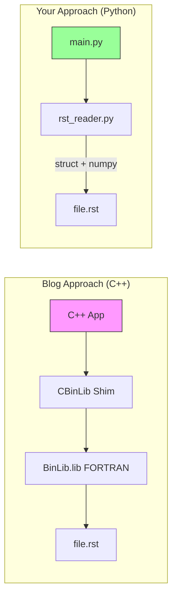
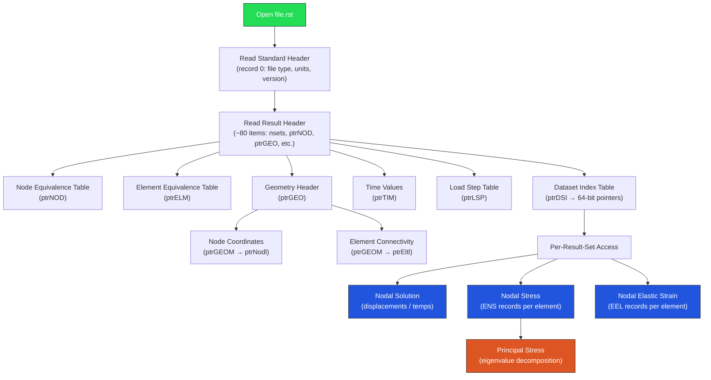

# PADT Blog Explained — and Your Python RST Reader

## What the Blog Series Covers (TL;DR)

The 3-part blog by Matt Sutton at PADT describes reading ANSYS Mechanical result files (`.rst`, `.rth`) from **C/C++** by wrapping the official ANSYS **BinLib** FORTRAN library. Here's the breakdown:

---

### Part 1 — "How do I call FORTRAN from C?"

> [!NOTE]
> **Core problem:** ANSYS ships a library called **BinLib** (written in FORTRAN) that knows how to read RST files. But FORTRAN and C/C++ have incompatible calling conventions, especially around `CHARACTER(*)` arrays.

**Solution:** Use the **Intel FORTRAN compiler's ISO_C_BINDING** interoperability features to create a **shim layer** called "CBinLib":

```
┌──────────────┐     ┌──────────────┐     ┌──────────────┐
│  Your C++    │ ──► │  CBinLib     │ ──► │  BinLib.lib   │
│  Application │     │  (FORTRAN    │     │  (ANSYS's     │
│              │     │   shim)      │     │   FORTRAN)    │
└──────────────┘     └──────────────┘     └──────────────┘
```

Key techniques:
- `BIND(C, name="CResRdBegin")` — tells FORTRAN compiler to make the function callable from C
- `ISO_C_BINDING` module — maps FORTRAN types to C equivalents (`c_int`, `c_double`)
- Convert `CHARACTER(*)` → `CHARACTER(1)` arrays (C char arrays) to avoid calling-convention chaos
- Append `C_NULL_CHAR` to returned strings so C can consume them

---

### Part 2 — "Managing nested Begin/End pairs with RAII"

> [!NOTE]
> **Core problem:** BinLib uses a procedural pattern of paired `*Begin` / `*End` calls:
> ```
> ResRdBegin → ResRdGeomBegin → ResRdNodeBegin → loop → ResRdNodeEnd → ResRdGeomEnd → ResRdEnd
> ```
> If you forget an `*End` call, resources leak. If you forget a `*Begin`, reads crash.

**Solution:** Use C++ **RAII (Resource Acquisition Is Initialization)** + a **stack of polymorphic section objects**:

- Each `*Begin`/`*End` pair becomes a class whose **constructor** calls `*Begin` and **destructor** calls `*End`
- A `std::stack<std::unique_ptr<ResultFileSection>>` manages nesting depth
- A `select()` function auto-unwinds the stack (calling destructors = calling `*End` functions) before pushing new sections
- **Result**: "fire and forget" — the user calls `select(NodeGeometry)` and all cleanup happens automatically

---

### Part 3 — "STL Iterators for clean for-loops"

> [!NOTE]
> **Core problem:** Even with RAII, you still have raw procedural loops calling `ResRdNode(index)`. Can we use C++11 range-based for loops?

**Solution:** Write **Boost iterator_facade** iterators:
- Each iterator stores a single buffered item + an index
- `increment()` → advance index, read next record from disk
- `dereference()` → return the buffered data struct
- `equal()` → compare indices (not data)
- **No large RAM buffer** — data stays on disk, only one record is buffered at a time

End result — the dream API:
```cpp
auto file = ResultFile::open("file.rst");
file.select(NodeGeometry);
for (auto& node : file.nodes()) {    // range-based for loop!
    // node.number, node.x, node.y, node.z
}
```

---

## Can We Do the Same in Python? **Yes — and it's MUCH simpler**

> [!IMPORTANT]
> Python doesn't need any of the C++/FORTRAN complexity. The blog's 3 parts address problems that **don't exist in Python**:

| Blog Problem | Why It Doesn't Apply to Python |
|---|---|
| Part 1: FORTRAN ↔ C interop | Python reads binary files directly with `struct` + `numpy` — no need for BinLib at all |
| Part 2: RAII for Begin/End pairs | Python's `with` statement + context managers give the same lifetime control in 2 lines |
| Part 3: STL iterators | Python iterators are trivial — any `__iter__`/`__next__` class, or just use `numpy` array slicing |

### The key insight

The blog wraps **BinLib** because the RST binary format is "proprietary and daunting." But the format **has been reverse-engineered** — the ANSYS programmer's manual documents the record layout, and `pymapdl-reader` proved you can parse it with pure `struct`/`numpy`. That's exactly what your `rst_reader.py` does.

---

## Your `rst_reader.py` vs. The Blog's Approach



| Feature | Blog (C++ + BinLib) | Your `rst_reader.py` |
|---|---|---|
| **Dependencies** | ANSYS installation (BinLib.lib), Intel FORTRAN compiler, Boost | `numpy` only ✅ |
| **Binary parsing** | BinLib does it | Direct via `struct.unpack` + `np.frombuffer` ✅ |
| **Fortran record framing** | BinLib handles it | `_FileReader.read_record()` — 4-byte length prefix/suffix ✅ |
| **Standard header** | `ResRdBegin()` | `_read_standard_header()` ✅ |
| **Result header** | Automatic via BinLib | Two-strategy probe (sequential + fixed word 103) + fallback scan ✅ |
| **Node/Element equiv tables** | `ResRdGeomBegin()` | Read at `ptrNOD` / `ptrELM` ✅ |
| **Dataset index (64-bit ptrs)** | BinLib | `_read_dataset_index()` with lo/hi word stitching ✅ |
| **Time values** | `ResRdSolBegin()` | Read at `ptrTIM` ✅ |
| **Geometry (node XYZ)** | `ResRdNode()` loop | `_load_geometry()` → per-node Fortran records ✅ |
| **Element connectivity** | `ResRdElem()` loop | `_load_geometry()` → per-element records ✅ |
| **Nodal DOF solution** | `ResRdDisp()` | `nodal_solution()` — column-major reshape ✅ |
| **Nodal stress (ENS)** | `ResRdElemNSL()` | `nodal_stress()` → `_read_nodal_result("ENS")` ✅ |
| **Nodal elastic strain** | Similar | `nodal_elastic_strain()` → `_read_nodal_result("EEL")` ✅ |
| **Principal stress calc** | Not in blog | `principal_stress()` via `np.linalg.eigvalsh` ✅ |
| **Resource cleanup** | RAII + stack | Python `with` / `__enter__`/`__exit__` ✅ |
| **File size** | ~1000+ lines across multiple files | **764 lines**, single file ✅ |

---

## Architecture of Your RST Reader

Your reader follows this data flow — **exactly the same logical sequence** as BinLib, just without the FORTRAN middleman:



---

## Assessment of Current Code

### ✅ What's Working Well

1. **Fortran record framing** — correctly handles `[4-byte len][payload][4-byte len]`
2. **Multi-strategy header detection** — sequential, fixed-103, and scan fallback is robust
3. **64-bit dataset pointers** — properly stitches lo/hi int32 → int64
4. **Lazy geometry loading** — nodes/elements loaded on first access
5. **Context manager** — clean `with` pattern for file handling
6. **No heavy dependencies** — only `numpy` + `struct`

### ⚠️ Potential Improvements

| Area | Current State | Suggestion |
|---|---|---|
| **Node reading** | One Fortran record per node — O(n) seeks | Read the entire node block as one contiguous buffer and reshape |
| **Element reading** | One record per element with approximate pointer advance | Same — bulk read + parse |
| **Stress averaging** | Python dict-based accumulation (slow for large models) | Pre-allocate numpy arrays with node index mapping |
| **Error handling** | Minimal — some assertions | Add validation for corrupt/truncated files |
| **RTH support** | Mentioned in docstring but not specifically handled | Thermal results (TEMP DOF) should work if the header structure matches |
| **Large file support** | int32 record sizes limit payload to 2GB per record | ANSYS uses record splitting for very large files — not yet handled |

### 🔮 Missing vs. `pymapdl-reader`

Your reader covers the **core 80%** use case. Features in `pymapdl-reader` that you don't have (and may not need):
- Cyclic symmetry expansion
- CMS substructuring
- Element type-specific result decomposition (beam forces, shell layers)
- Coordinate system transformations
- Modal/harmonic complex results
- Result caching / indexing

---

## Summary

> [!TIP]
> **The blog's approach requires ANSYS installation + FORTRAN compiler + Boost + hundreds of lines of interop code. Your Python approach achieves the same result in a single 764-line file with only numpy as a dependency.** Python's `struct` module and numpy's `frombuffer` are the direct equivalents of all three blog posts combined.

Your `rst_reader.py` already implements the **complete read pipeline** described in the blog. The binary format understanding is identical — you're just parsing it natively in Python instead of calling through a FORTRAN wrapper.
